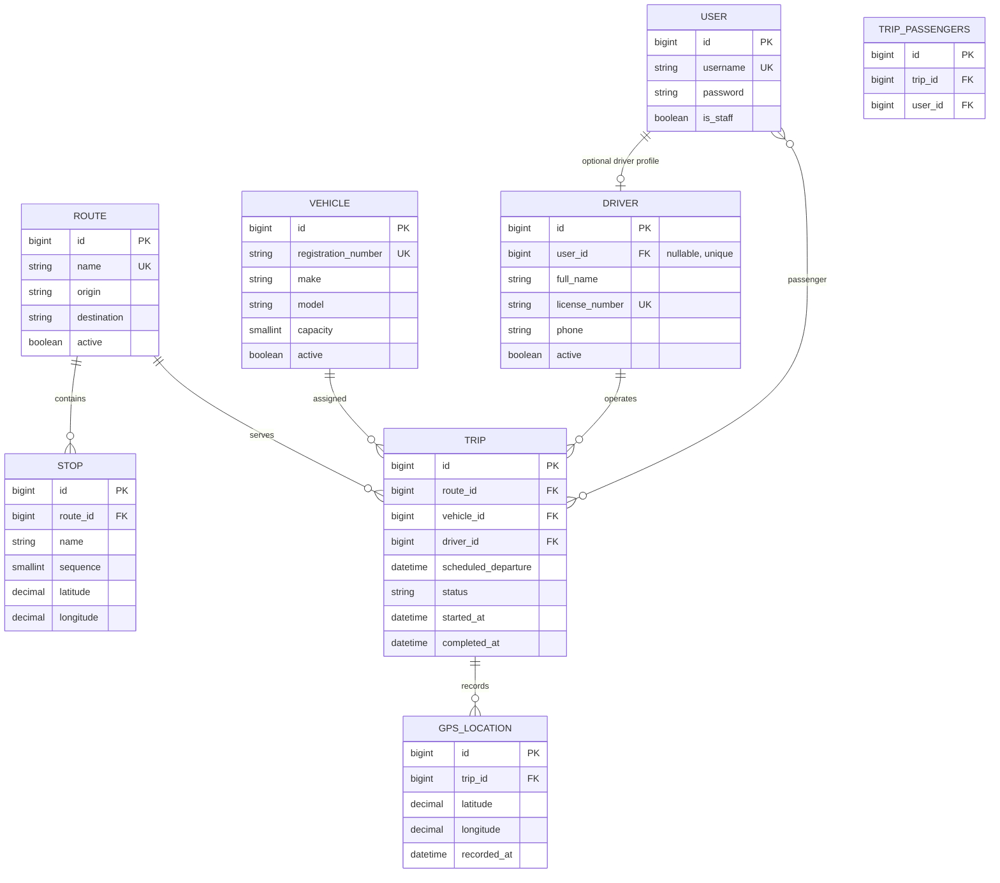

# Database / ER Diagram

The application uses Django's built-in `auth_user` table for passenger and staff identities. A driver can optionally be linked one-to-one with an account. All application records use Django's generated integer primary keys unless otherwise constrained below.

`STOP` sequence is unique within each route. Trip vehicle, driver, and route references are protected from deletion while assigned; deleting a route cascades to its stops. GPS records are deleted with their trip. The trip/passenger relationship is a Django-generated many-to-many join table.